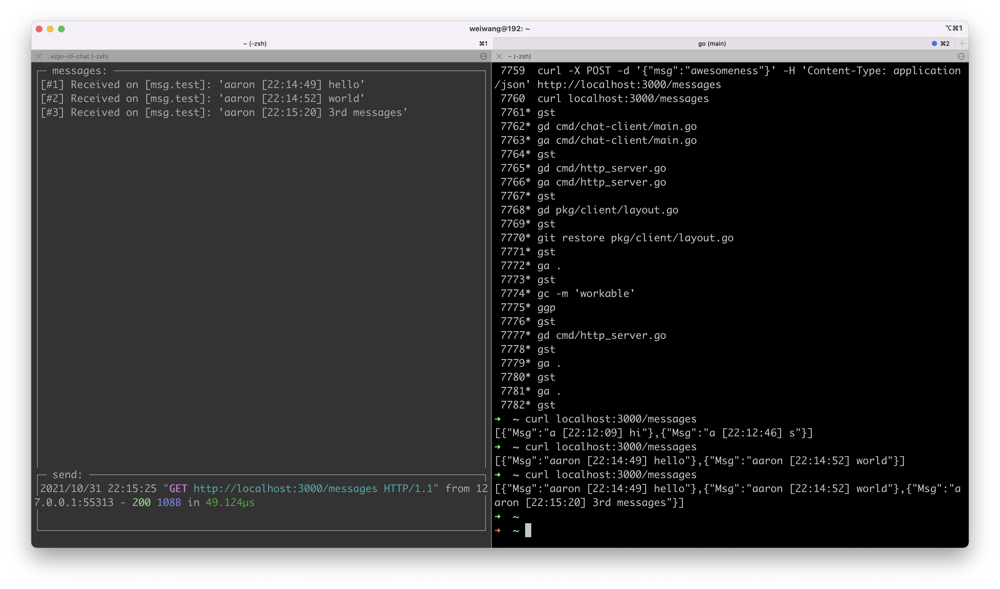

## 💬 go-cli-chat

Chat server and client written in Go (simple prototype). The application heavily utilizes goroutines and channels. Go makes the concurrency easy to use and I had a lot of fun during development of this simple app.



### Usage

1. Start the NATS server
```bash
$ go get github.com/nats-io/nats-server; nats-server &
```
The NATS server listens for client connections on TCP Port 4222.


2. Build and run client:

Build and run `chat-client`:

```bash
$ make run-client
```

Run `chat-client` binaries in `cmd/` dir:

```bash
$ ./cmd/chat-client/chat-client
```

3. Run HTTP Server
```bash
$ make run-http-server
```
   The HTTP server listens for client connections on TCP Port 3000.
#### REST Usecases
    $ curl -X POST -d '{"msg":"awesomeness"}' -H 'Content-Type: application/json' http://localhost:3000/messages
    {"Msg":"awesomeness"}
    
    $ curl localhost:3000/messages
    [{"Msg":"a [21:59:24] hi"},{"Msg":"awesomeness"},{"Msg":"a [21:59:49] pp"}]

### Please Note

I have leveraged below repos on this projects 
- https://github.com/Luqqk/go-cli-chat
- https://github.com/go-chi/chi

### Known Issues
- Username and timestamp are attached to msg body.
- All messages send and receive are on `msg.test` subject.